# Globus Data Transfer from SEMC

## Introduction

Globus is an application that lets you transfer large amounts of
research data efficiently and securely to your personal computer,
institution's storage systems or a cloud provider. It eliminates the use
of big portable external hard drives that need to be mounted to a local
storage to transfer data. The New York Structural Biology Center
primarily uses Globus to transfer data that is collected on-site from
electron microscopes. To get started with, follow the instructions
below.

## Logging in to Globus

Typically, you can log into Globus with your institutional credentials.
To determine if this is possible, check if your institution is listed
under the dropdown menu located on the [Globus login
page](https://app.globus.org). If it is, you
can skip to the next section (*Logging in with Institutional
Credentials*).

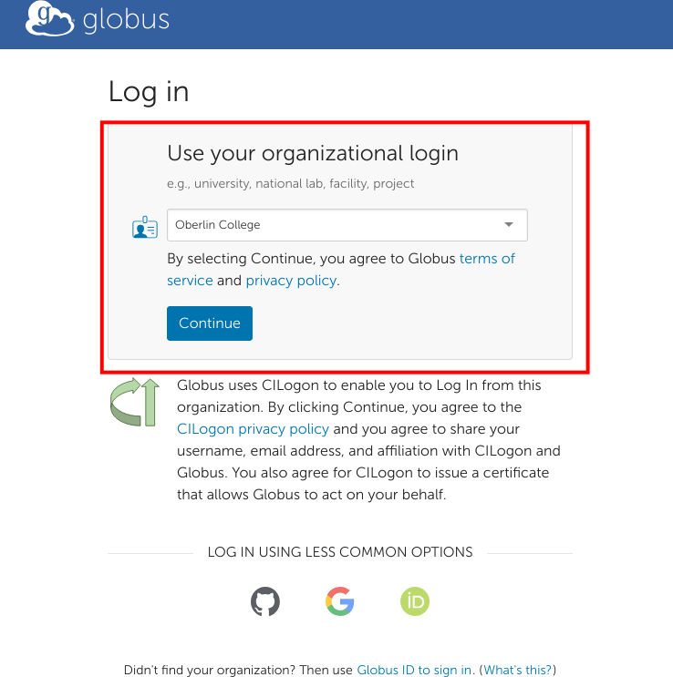

### Creating an ORCID Account and Linking it with Globus

If you do not have access to Globus via your institution, you can use
your ORCID to sign in to Globus. If you do not already have an ORCID,
you can sign up for one [here](https://orcid.org/register). To sign in
with your ORCID, you will need to click the green ORCID button on the
login page:

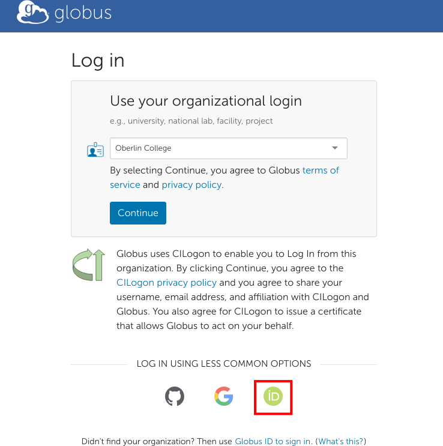

You will then be prompted to connect your ORCID to Globus. Click the
*Authorize access* button when prompted.

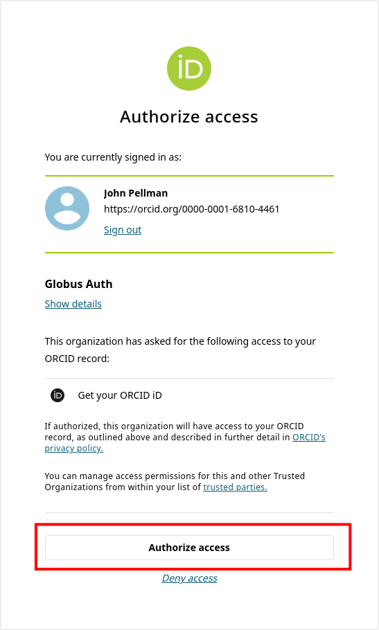

If your ORCID account is successfully linked with Globus, you will be
presented with the following screen. Click *Continue*.

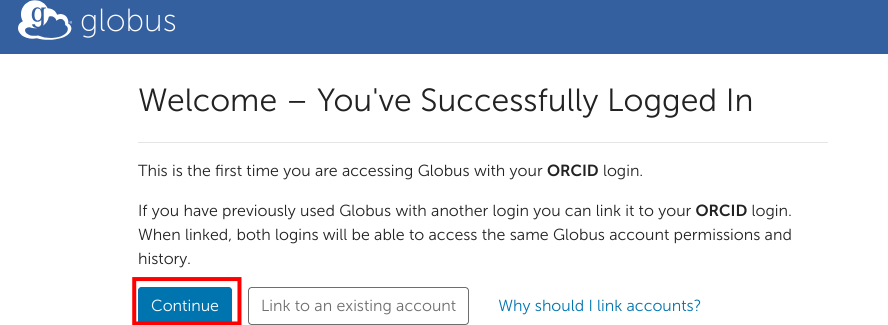

Fill out the subsequent form. Enter in your email address and
organizational affiliation when prompted.

Finally, grant Globus the permissions it needs from your ORCID account
by clicking on *Allow* on the last screen:

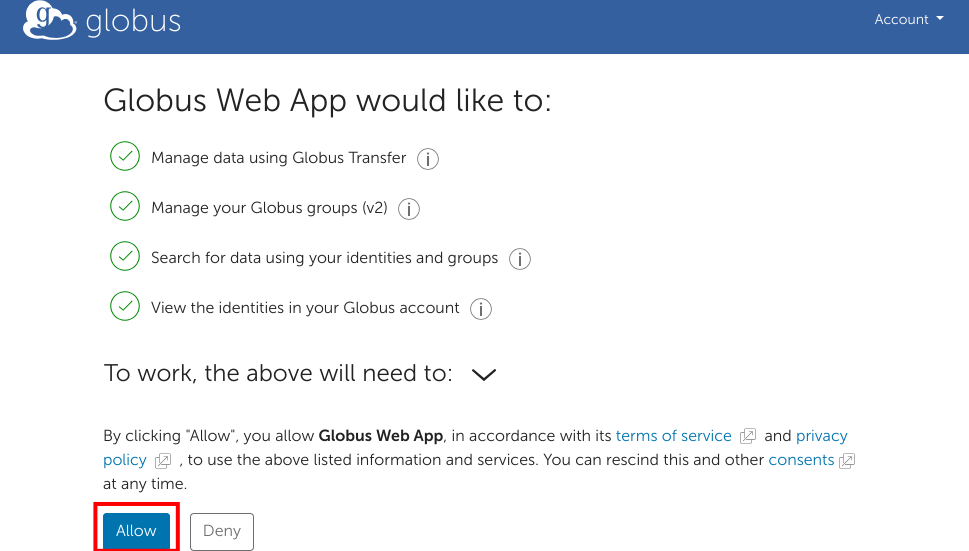

You should now be logged into Globus. For future sessions, you can click
the green ORCID button on the main page to log in again.

### Logging in with Institutional Credentials

Select your institution from the dropdown on the Globus login page and
click *Continue*.


You will now be prompted with the dialogue you typically use to log in
to your institution's services (email, etc). Enter your institutional
credentials (e.g., NetID, UNI) and sign in as normal.

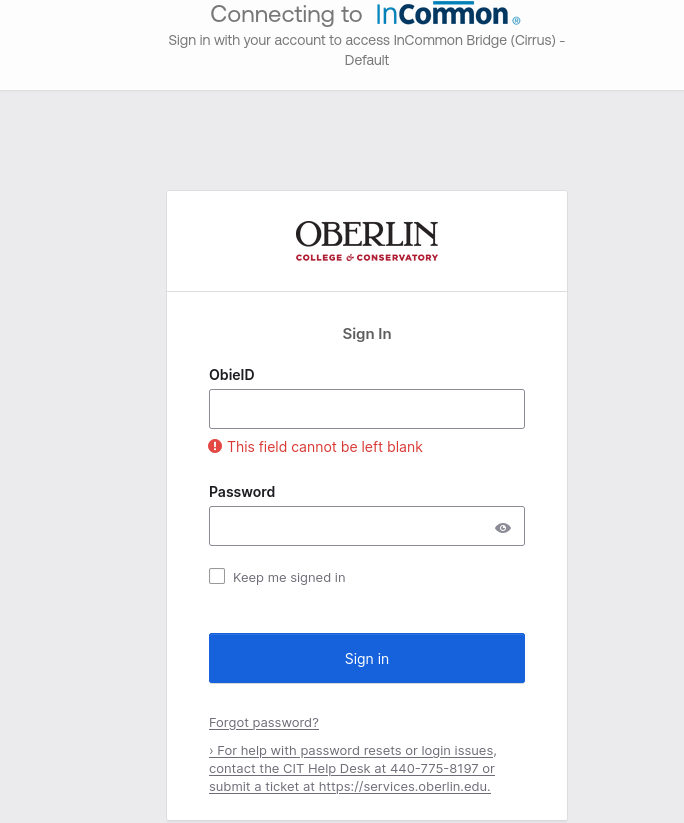

### Globus File Manager

Once you have successfully signed in (via ORCID or institutional
credentials) you will be presented with the Globus file manager. In the
next section, we will describe how you can use this web interface to
initiate data transfers to your home institution.

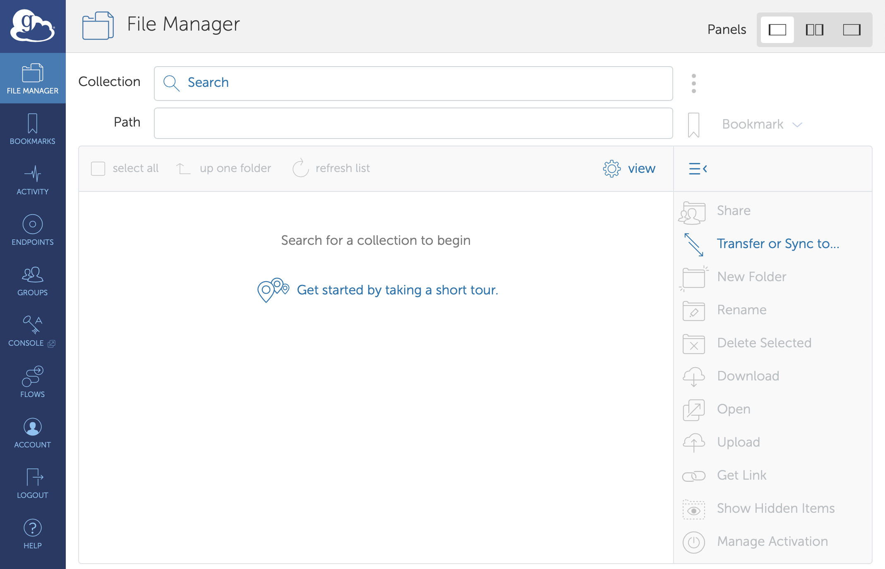

## Transferring Data

### Transferring files from NYSBC to your personal endpoint

1. Click on the Collections tab and type 'NYSBC#SEMC' This will act as
your source endpoint, where you will be transferring files from

    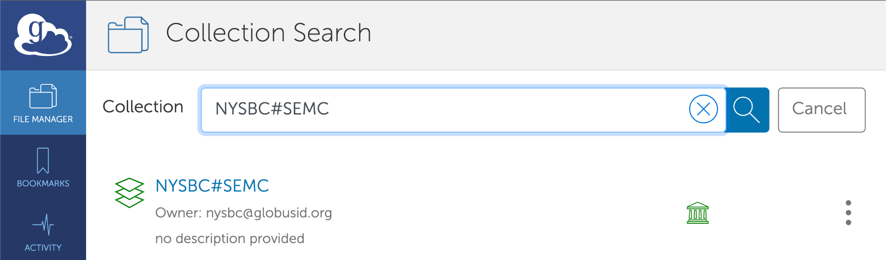

2. You will see a login widget below which will ask for your username
and password to authenticate. Please take note that you need to enter
the username which was provided by SEMC when you first registered for
your project. Also, note that this username is all lowercase

    If you are already logged into another NYSBC account. Please go to
*Settings* -> *Manage Identities* -> *NYSBC OIDC Server*

    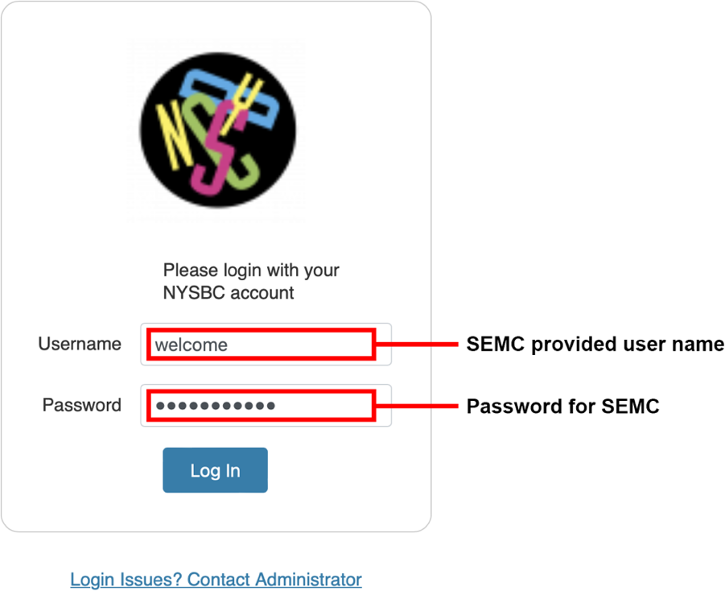

3. After you authenticate, you will see your default path which is
currently set at `/h1/<username>`.

    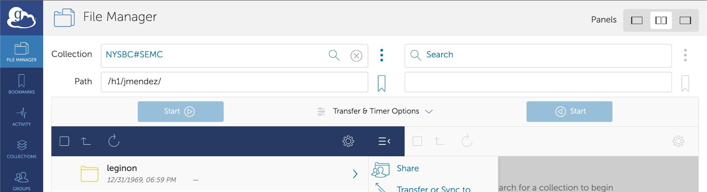

4. You can transfer raw frames and references by selecting the 'frames'
folder
    * Select your username.
    * Then, select the session you want to transfer frames from eg:
    22mar18g).
    * Under the `rawdata` folder, you will see all your raw frames

5. You can also transfer aligned images by selecting the 'leginon'
folder

    * Select your username
    * Then select the session you want to transfer frames from eg:
    22mar18g)
    * Under the rawdata folder you will see all your aligned images

    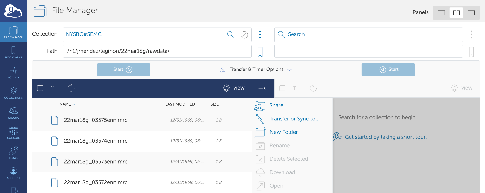

6. Now, you need to select the destination endpoint. For transferring
files to your personal computer, you need to install Globus Connect
Personal. Click on *Endpoints* on the left navigation bar and select '⊕
Create a personal endpoint' on the top right of the screen

    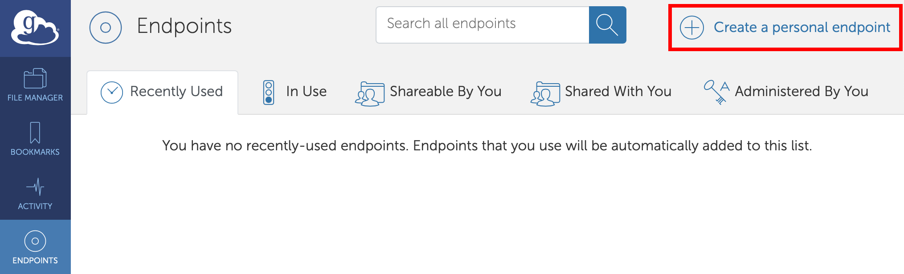

    You will see the following screen

    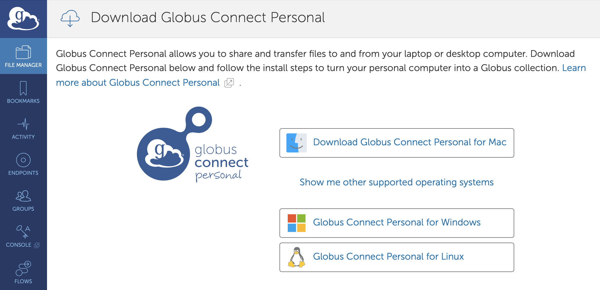

 * Download and install the Globus Connect Personal as per your OS
distribution.  For specific installation instructions:
    * [Mac](https://docs.globus.org/how-to/globus-connect-personal-mac/)
    * [Windows](https://docs.globus.org/how-to/globus-connect-personal-windows) 
    * [Linux](https://docs.globus.org/how-to/globus-connect-personal-linux/)

    * Log In, then press allow, this will take you to the Globus Connect
     Personal Setup
        * For Owner Identity, select your Globus ID
        * Enter your endpoint collection name. eg: Personal Computer
        * Press 'Save'

    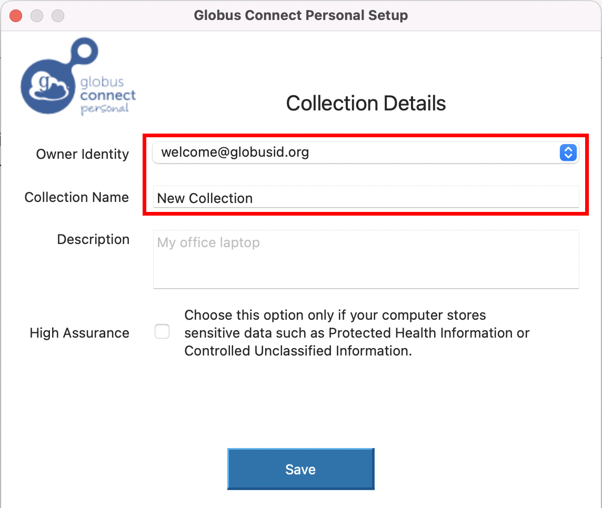

8. Next, select your personal endpoint as your destination endpoint. Go
back to the file manager and select **NYSBC#SEMC** in the Collection tab.
9. Then select, transfer and sync to option.
10. On the right side, select your personal endpoint as the destination
endpoint. Please see the screenshot.

    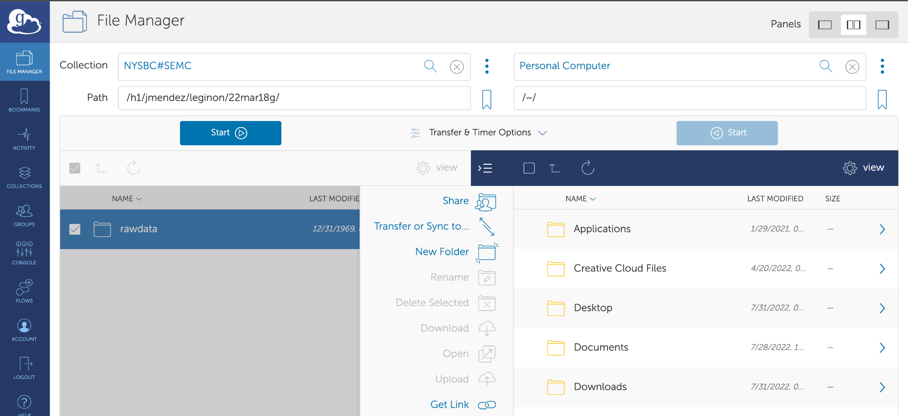

    You will now see the folders on your laptop.

11. Once you select the appropriate source and destination folder, then
click on Start to initiate the transfer process

    

12. To monitor the transfer process, click on the Activity tab on the
left sidebar

You will see the transfer logs and the message when the transfer is
completed.

Note: Sometimes, your personal computer will be under a firewall which
will not allow transferring files. To configure your firewall settings,
please see the Globus documentation [here](https://docs.globus.org/how-to/configure-firewall-gcp/).

For any issues related to Globus please check the following guides:

 * [https://docs.globus.org/how-to/](https://docs.globus.org/how-to/)
 * [https://docs.globus.org/faq/](https://docs.globus.org/faq/)

### Transferring files from NYSBC to your home institution endpoint

 * Follow steps 1 - 5 as described above.
 * Then select your home institution endpoint as the destination
 ndpoint. Please contact your organization's IT team to acquire the name
 f the endpoint authorized by your institution and for the login
 redentials and queries related to your directory permissions.
 * Follow step 11 as described above.
 * You can keep track of data transfer status by clicking on the
Activity tab. When the transfer is completed, you will see a green check
mark and "Condition" will say SUCCEEDED.

## FAQ

### I'm unable to link my Globus account to my NCCAT/MEMC account from the CUIMC Campus

The typical advice we give to Columbia affiliates if they encounter an
error with Globus account linking is to first switch to a different
network (e.g., a WiFi hotspot). This is because our Globus endpoint
domain (*globus3.5540bd.75bc.data.globus.org*) apparently cannot be
used on certain CUIMC networks. Specifically, our Globus domain cannot
be resolved (i.e., its domain name cannot be mapped to an IP address).
The *domain globus3.5540bd.75bc.data.globus.org* is managed by Globus
(not us) and in turn, uses Amazon as a domain name provider. Ultimately
this means that there is a problem with CUIMC IT's domain name
infrastructure where Amazon domains cannot be reached; from the outside
it's unclear if this an actual issue or just a matter of policy related
to the protection of patient data / PHI.

If you keep encountering this issue, our advice would be to contact
CUIMC IT and/or Globus support.

### How do I unlink my MEMC account and link my NCCAT account (and vice versa)?

If you currently have a MEMC account linked to your Globus account, you
may not be able to access your NCCAT directory (or vice versa). If this
is the case, you should use the following instructions to unlink your
MEMC account and link to your NCCAT account:

1. Click on *Manage Identities* on the *Settings* page in the Globus
web UI.
2. Then on the next page click on the trash can icon in the same row as
*<username>@globus3.5540bd.75bc.data.globus.org*.
and then click on *Unlink Identity*. 
3. Next time you are prompted to log in with your credentials, use your
NCCAT account and its associated password.

### My Globus transfer times out every 5-10 minutes and is proceeding very slowly

On rare occasions, your transfer may proceed slowly and then time out at
regular intervals. The time-out errors will look something like the
following:

```
Error (transfer)
Endpoint: myuniversity#endpoint(586f0817-9bd9-4eb5-bbdd-017afd630986)
Server: m-98f9a0.99817a.0ec8.data.globus.org:443
Command: STOR
/path/to/myfile.mrc
Message: The operation timed out
---
Details: Timeout waiting for response
```

As an initial troubleshooting step, we suggest that you run your
transfer over a VPN (such as [ProtonVPN](https://protonvpn.com/) or
[Mullvad](https://mullvad.net)). If this does not resolve the issue,
please contact the MEMC or NCCAT office and we can assist. A longer
explanation of the most common cause for this issue can be found below.

#### Why this issue occurs

If your Globus endpoint is on a university/research institute campus,
the particular issue that you are encountering is most likely caused by
a quirk of how internet routing works. Our network engineer has
configured our gateway router so that outgoing traffic is sent over
[NYSERNet](https://nysernet.org/home) (our regional research and
education network). Our network also sends a message to other networks
(such as your institution's network) telling them to send incoming
traffic over NYSERNet as well. However, sometimes this message (a route
advertisement) does not reach a network, and incoming traffic is routed
differently.

This asymmetry in routing (outbound traffic over NYSERNet, inbound
traffic from another network) causes the connection to become
periodically interrupted, and every time this happens your Globus client
needs to create an entirely new connection, which slows the transfer
down considerably.

Our network engineer's workaround for this is to manually implement an
exception to our normal routing logic. For this to work, we require a
fixed IP address or range for the destination that traffic should go to.
